# Projeto de Interface

Pré-requisitos: <a href="2-Especificação.md"> Documentação de Especificação</a>

> Apresente as principais a interface da plataforma. Discuta como ela
> foi elaborada de forma a atender os requisitos funcionais, não
> funcionais e histórias de usuário abordados nas [Especificações do
> Projeto](2-Especificação.md).

## User Flow

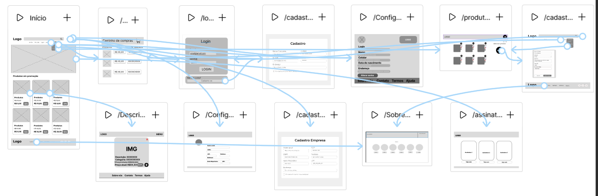

## Wireframes Home Page

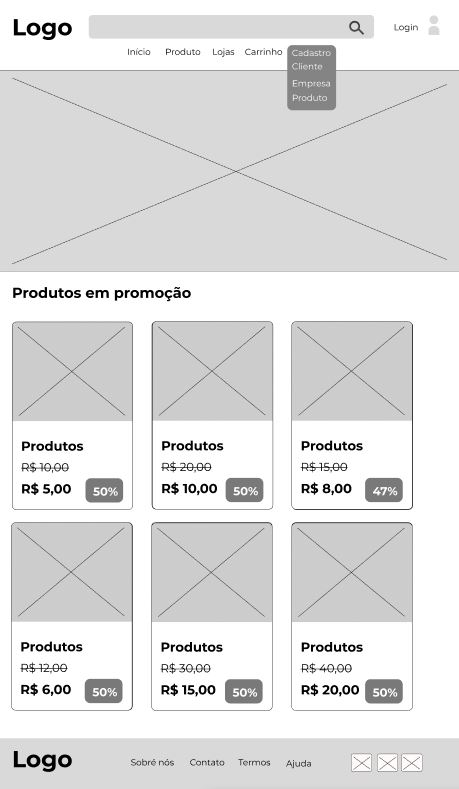

## Wireframes Login

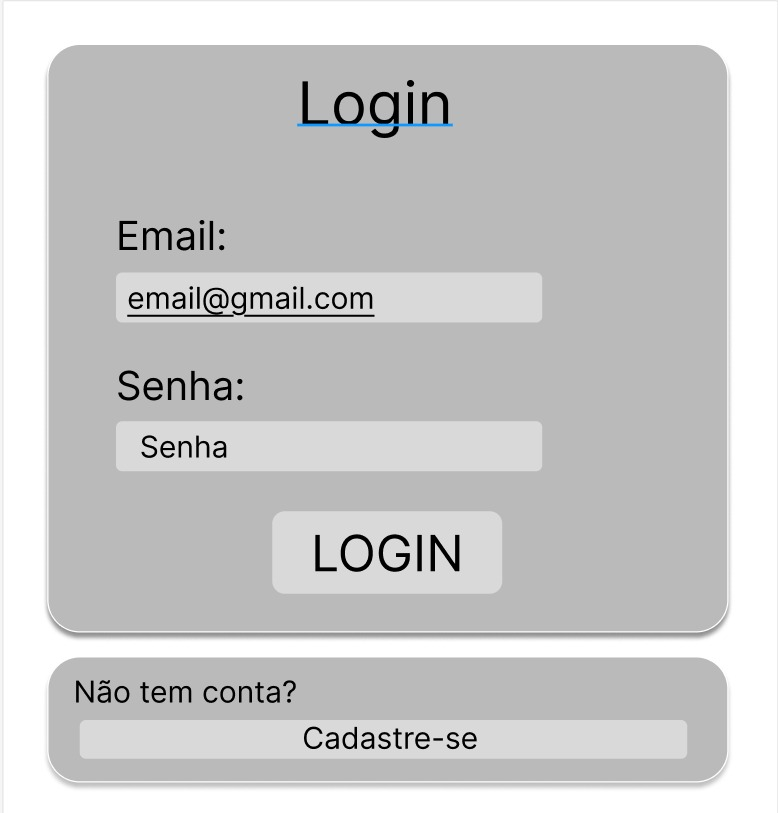

## Wireframes Cadastro Cliente

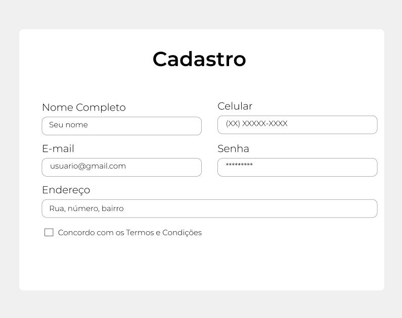

## Wireframes Configuração de perfil Cliente

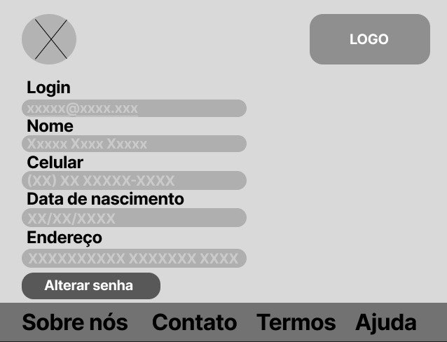

## Wireframes Cadastro Empresa

## Wireframes Configuração de Perfil Empresa

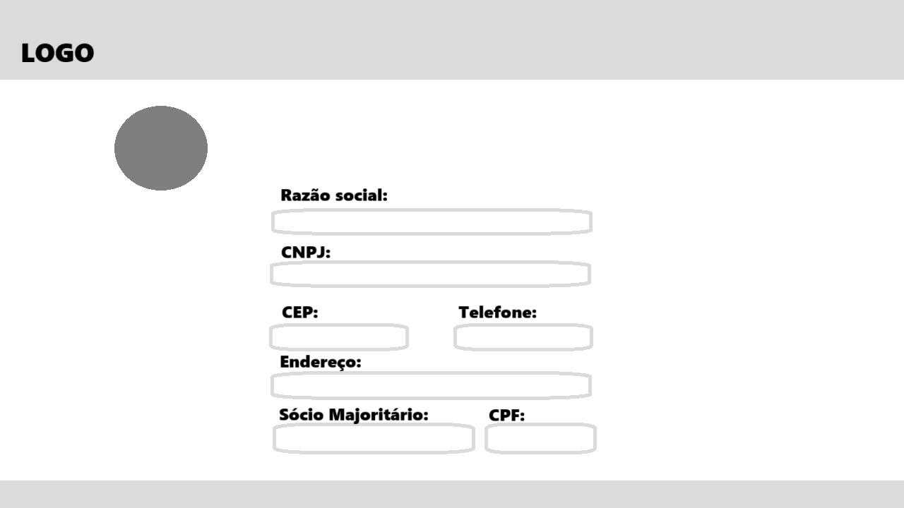

## Wireframes Carinho de Compras

## Wireframes Sobre

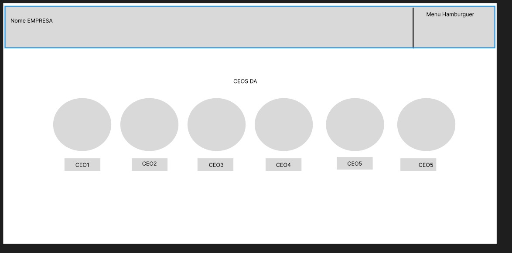

## Wireframes Assinatura

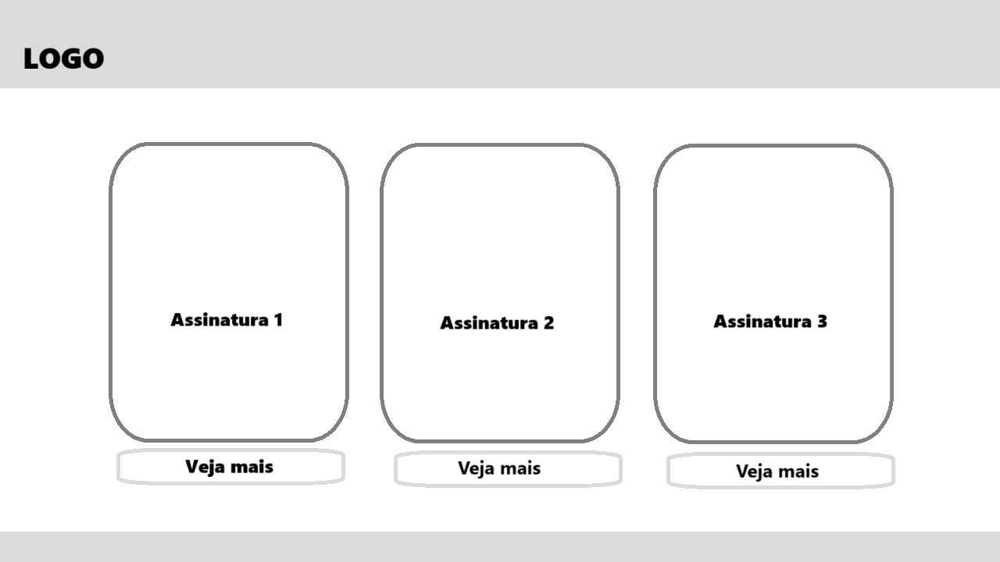

## Wireframes Detalhes Quando Clica no Produto

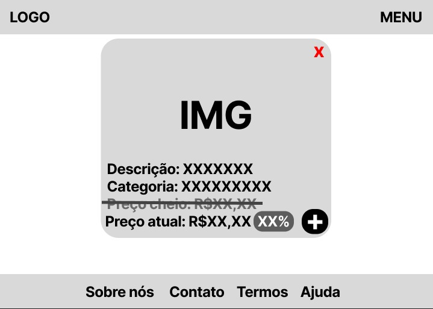

## Wireframes Vizualizar Produto Cadastrado

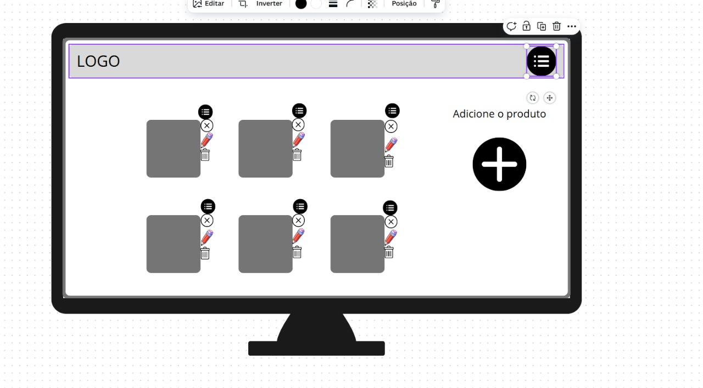

## Wireframes Vizualizar Produto Cadastrado

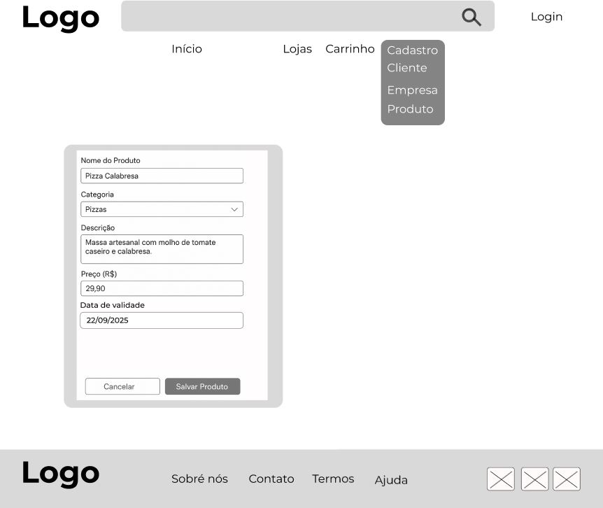

